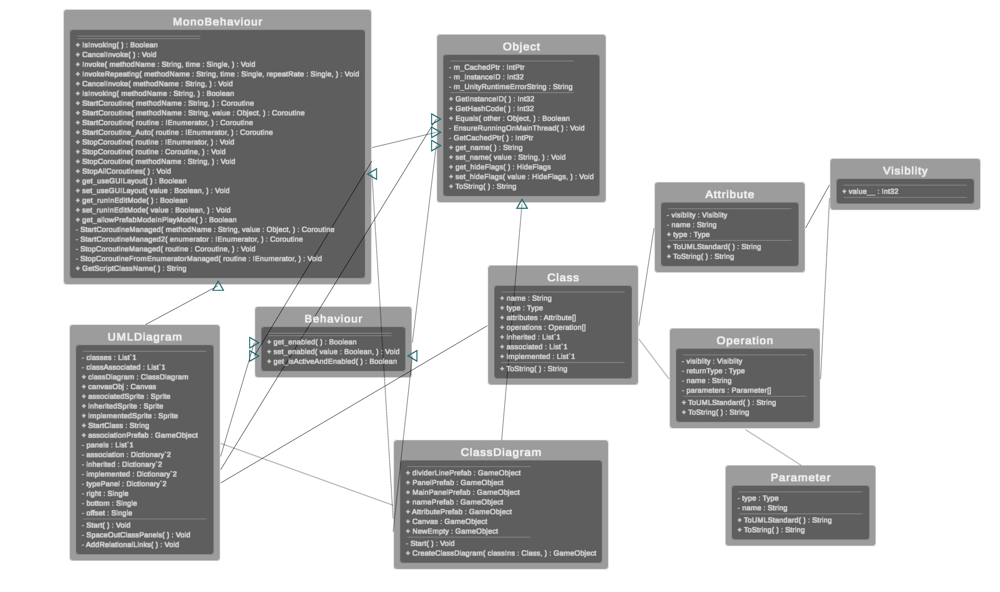

# Unity-UML-Generator
Tool to generate UML diagram for Unity/C# projects.
Currently only supports class diagrams.

## Class Diagram -

## How to use -
1. Import UMLDiagram.unitypackage.
2. Open the UMLDiagram scene.
3. In the scene, add the Start Class in the UMLDiagram script on the UML GameObject.
4. Hit run. Your class diagram should be generated.
5. Play around with the canvas(World Space) rect to ensure all your classes are in view.
6. The panels can be dragged around in the game window.
7. Then screenshot it once you are ready. Window/UMLDiagram/Take ScreenShot.
8. Your diagram(PNG) will be saved in the root folder of your project.

## Future Features -
- [ ] Enable users to delete and add classes during runtime.
- [ ] Add more UML Diagrams like activity, use-case diagram.
- [ ] Highlight insights from Diagrams.
